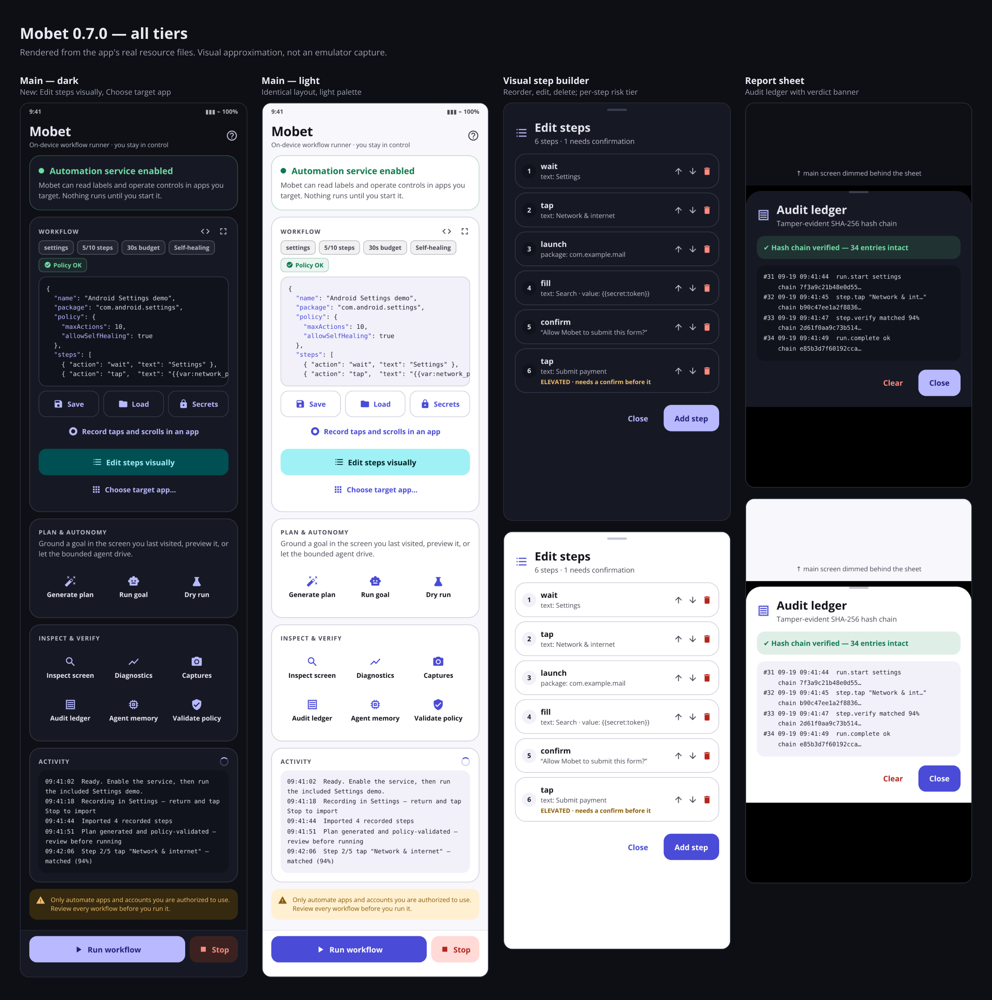
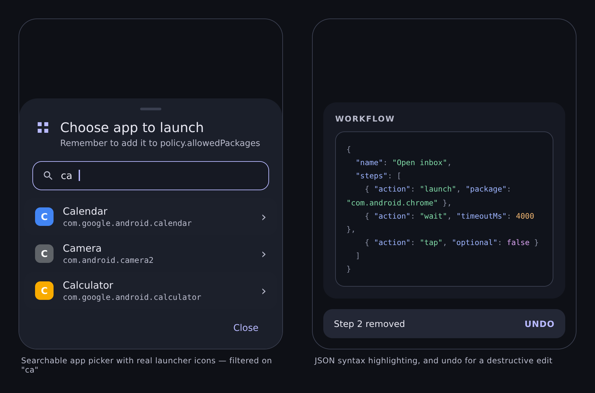

# Mobet

## Local build prerequisites

Mobet targets Java 17 and Gradle 8.9. Use `./gradlew` for a clear prerequisite
check; CI provisions the toolchain automatically. The repository intentionally
does not commit the Gradle wrapper JAR or a JDK.

```sh
./gradlew :app:testDebugUnitTest
```

If the check reports a missing tool, install a JDK 17 and Gradle 8.9 using your
OS package manager or Gradle toolchain manager.


Mobet is an Android-first, on-device mobile automation prototype. It uses Android's Accessibility API to locate controls and run explicit JSON workflows that the phone owner starts.

## Frontier capabilities (v0.8.0)

- **Advanced workflow generation engine** — goals, recorded traces, and parameterised recipes all compile through one offline pipeline: a typed intent IR, grounding against the live accessibility snapshot (resolved / ambiguous → bounded `tryAlternates` / not found), robustness lowering (waits, `expect` assertions, bounded `branch` and `repeatUntil` with explicit join labels), mandatory risk confirmations, least-privilege policy synthesis, and a real parse plus `PlanValidator` pass. A deterministic peephole optimizer removes redundant scaffolding, literal fill values are hoisted into editable variables (credentials excluded), an advisory 0–100 robustness grade flags drift-prone selectors and unverified steps, and existing plans can be re-grounded against the current screen at authoring time. Verified autonomous runs crystallize into deterministic replayable workflows, execution feedback (per-package selector resolution history) steers grounding within a hard ±0.05 bound, screen-borne `{{secret:…}}` labels are refused at every construction path, and Insert shows a step-level diff first. Generation is deterministic, has no device effects, and emits a decision-by-decision report before anything can run. See [docs/WORKFLOW_GENERATION.md](docs/WORKFLOW_GENERATION.md).
- **User-visible build integrity** — every APK embeds a canonical capability manifest with version, source commit, workflow, attestation reference, signing expectation, engine declarations, and policy/ledger versions. Mobet verifies it against the installed package offline, computes the APK SHA-256, and records the first-launch verdict in the hash-chained ledger.
- **Independently verifiable ledger exports** — the app exports a screenshot-free, secret-redacted evidence bundle containing build and policy identity, the original ledger head, and a portable hash chain over the exact exported events. A standard-library Python utility verifies it without Mobet.
- **Visual execution timeline** — workflows and autonomous goals expose their current goal, subgoal, structural screen fingerprint, selected action, confidence, evidence, risk, policy verdict, recovery, and terminal reason through bounded typed events in the Activity card.
- **Risk-authorized tool boundary** — every tool declares typed input/output schemas, package scope, risk, confirmation requirements, and autonomous eligibility. Dispatch revalidates authority and writes redacted arguments, policy decisions, confirmation outcomes, and result digests to the ledger.
- **Offline voice-engine abstraction** — Android on-device recognition, optional local PCM model packs, and explicit unavailability share one coroutine boundary. There is no cloud fallback; local buffers are zeroed and transcripts remain editable, non-authoritative input.
- **Intent-to-plan preview** — typed and reviewed voice goals become package-bound structured goals with fixed budgets and halt conditions. Explain and Dry-run modes have no device effects; execution requires a separate explicit tap.
- **Reversible recovery planning** — autonomous actions record before/after fingerprints, reversal availability and outcome, retries, and recovery cost. A deterministic strategy orders wait, repair, modal dismissal, backtrack, replan, ask, and abstain; destructive failures are never blindly retried.
- **Runtime app boundaries** — workflows can bind allowlisted packages to exact installed versions; every action rechecks package and version. Unattributed user clicks/scrolls, permission surfaces, System UI, accessibility interruption, and unexpected package transitions stop the run.
- **Offline workflow bundles** — v2 bundles are hash-addressed canonical JSON with author, package, permission, risk, network, and optional ECDSA signature metadata. Imports remain quarantined until hash, signature, parser, and policy reports are shown; import never executes.
- **Release evidence** — release CI emits a deterministic screenshot-free evidence envelope, SLSA provenance reference, APK/capability hashes, and an honest two-build reproducibility report as separate release assets.
- **Offline SLSA verification** — imported Sigstore bundles are checked in-app against a pinned public-good trust root, exact GitHub workflow identity, DSSE/Sigstore transparency evidence, installed APK digest, SLSA v1 source, commit, workflow, and builder claims.
- **Device-reliability layer** — autonomous decisions require structurally settled observation quorums with strict sample deadlines. Resource governance blocks new operations under severe thermal pressure or critically low battery, while generation-scoped callbacks eliminate lifecycle races.
- **Executable hierarchy and probabilistic planning** — subgoals now run through an explicit state machine whose preconditions and completion evidence advance only after observed transitions. Bayesian learned-route reliability, bounded beam-style lookahead, reversible-action utility, and local replanning cooperate under hard budgets.
- **Consent-controlled multimodal perception** — the run dialog can opt into on-device OCR for completion evidence. OCR is source-attributed, confidence-gated, temporally fused, requires repeated observations, is never persisted, and never creates tap authority; accessibility remains canonical.
- **Operational model assistance** — an optional structured on-device assistant decomposes clauses and ranks only deterministic-policy-approved action IDs. Output schemas reject invented IDs and injection patterns, and model influence is capped to a small tie-break rather than safety authority.
- **Production security controls** — both memory and the audit ledger are AES-GCM authenticated with Android Keystore keys and atomic migration. Fresh-snapshot action canonicalization, package provenance, prompt-injection filtering, anti-replay checkpoints, least-privilege package visibility, CodeQL, dependency review, and Android lint are enforced.
- **100-world adversarial evaluation** — seeded generated worlds cover UI wording drift, loading interruptions, ambiguity, prompt injection, deceptive financial controls, and risk abstention, with hard success, cycle, and zero-safety-violation assertions.
- **Operational resilience** — encrypted crash checkpoints never auto-resume or replay irreversible operations. Active runs expose an ongoing notification with emergency Stop, remain explicitly user-started, and retain in-app Stop as a fallback.
- **Adversarially hardened autonomy** — every proposed selector is canonicalized against a fresh live snapshot immediately before execution; foreign-package success spoofing, stale callbacks, screen-borne prompt injection, forged action metadata, and transient one-frame completion evidence fail closed. Autonomous runs have independent cycle, search-expansion, candidate, depth, retry, package, risk, and wall-clock budgets.
- **Encrypted adaptive intelligence** — episodic and semantic memory is AES-GCM encrypted with namespace-bound authenticated data and a non-exportable Android Keystore key. Bayesian route reliability resists one-shot overfitting; temporal evidence decays; repeated prediction contradictions trigger structural-drift invalidation; legacy plaintext metadata migrates atomically and is deleted only after a successful encrypted commit.
- **Zero-write CI security posture** — CI runs with read-only repository permissions and no persisted checkout credential, performs deterministic intelligence tests plus Android security lint, then assembles the APK and publishes reports. The app rejects cleartext traffic and protects its UI with `FLAG_SECURE`. The manual *Pin dependency checksums* workflow writes `gradle/verification-metadata.xml` (sha256+sha512 for every resolved artifact); once committed, every CI build verifies the pins fail-closed — a swapped registry artifact breaks the build loudly instead of shipping.
- **Live Apex Android agent** — accessibility snapshots are converted into node-free `AgentObservation`s and selected tap/scroll/back actions return through a narrow guarded gateway. Every operation is translated to a typed workflow, rescored by `RiskEngine`, validated by `PlanValidator`, confirmed when required, and executed only by `WorkflowRunner`. The UI exposes bounded goal runs with explicit completion evidence and Stop.
- **Persistent private memory** — successful and failed transitions, dead ends, selector-repair hashes, confidence, recency, and app-version metadata survive restarts. Confidence decays over 45 days, dead ends expire, major app versions invalidate old routes, storage is bounded, and screen/OCR text, entered values, secrets, and screenshots are excluded.
- **Hierarchical, uncertainty-aware planning** — goals decompose into subgoals with explicit preconditions and completion evidence. Accessibility, optional OCR, user, and world-model evidence remain separately attributed in a belief state; ambiguous candidates cause abstention instead of a guess.
- **Budgeted lookahead and recovery** — deterministic candidate ranking has hard action and expansion caps and optimizes learned success, semantic fit, risk, confidence, and reversibility. Failures are classified as stale selectors, loading delays, modal interruptions, wrong app, permission gates, device rejection, or dead ends, each with a bounded recovery policy.
- **Non-authoritative model boundary** — an optional model can return only structured subgoal suggestions or rankings over already-safe action IDs. Schema validation rejects unknown IDs; models never receive accessibility authority and cannot bypass policy, confirmation, execution, or verification.
- **Intelligence regression gates** — deterministic benchmarks track success, cycles, unnecessary actions, abstention quality, and safety violations with CI-enforced thresholds.
- **Bounded autonomous intelligence** — a platform-neutral `AutonomousAgent` repeatedly observes, deliberates, acts, and verifies instead of blindly replaying a plan. Package, risk, and cycle budgets remain hard boundaries enforced independently of the deliberation policy.
- **Verified exploration and backtracking** — safe reversible actions may be explored when no learned route exists. Unchanged screens, rejected actions, loops, and exhausted branches become dead ends; the agent backtracks rather than repeating them.
- **Experience-guided navigation** — a bounded `ExperienceStore` retains successful transitions and dead ends. `ExperienceNavigator` searches this learned graph without cycles, while every proposed action remains subject to live verification.
- **Counterfactual agent validation** — autonomous proposals are rejected if they exceed risk or cycle limits, and irreversible actions may only be terminal. The device adapter retains final authority over execution.
- **Deterministic autonomy benchmark** — thirty synthetic navigation tasks must maintain a 100% success rate in no more than 90 total action cycles, alongside focused tests for risk abstention, graph cycles, dead-end memory, belief ambiguity, failure policies, and backtracking.
- **Graduated risk engine** — every step is scored by a deterministic, explainable `RiskEngine` (consequential, destructive, financial, and credential signals are additive). `ELEVATED` steps require an adjacent confirm; `CRITICAL` steps (e.g. "Confirm transfer of $500") escalate to a **hardened typed confirmation** where the user must literally type `APPROVE`.
- **Self-healing selectors (opt-in)** — when an app update renames "Network & internet" to "Network and internet" or rotates a resource ID, the runner can heal the selector against the live screen using blended Jaccard + Levenshtein similarity. Healing is policy-gated (`allowSelfHealing`), limited to LOW-risk steps, one-shot per step, requires both a confidence floor *and* a margin over the runner-up so it abstains rather than guesses, and every heal is logged.
- **Counterfactual dry run** — `Dry run` statically walks the plan against the last accessibility snapshot without touching the device: per-step grounding grades (✔ / ≈ / ✖), risk tiers, confirmation gates, and an estimated duration. Secret and literal fill values are masked in the report.
- **Loop guard + screen fingerprinting** — each observed screen is hashed into an order-insensitive structural fingerprint; a screen revisited too many times without progress aborts the run instead of burning the runtime budget.
- **On-device world model** — Mobet passively learns a screen-transition graph (`fingerprint --action--> fingerprint`) while workflows run. Only structural hashes and the selectors from your own workflows are stored, bounded to 400 edges, never leaving the device. It gives future planners a grounded navigation prior.
- **Tamper-evident audit ledger** — every runner event is appended to a SHA-256 hash chain (`hash = H(prev | seq | ts | event)`). The **Audit ledger** screen re-verifies the whole chain and pinpoints the first broken link if the history was altered.
- **Risk-aware goal compiler** — the offline planner now shares the exact same `RiskEngine` as the runner, inserts confirmations with the *reason* attached, grounds `fill` clauses only against editable elements, understands `go back` and `scroll`, and uses typo-tolerant fuzzy grounding.
- **JVM unit test suite + CI** — deterministic components (risk engine, validator, fuzzy matcher, resolver, fingerprints, planner, simulator, parser) are covered by plain JUnit tests, run in GitHub Actions on every push alongside a debug APK build.

## Interface



> The previews above are rendered from the app's own resource files (`colors.xml`,
> `dimens.xml`, `strings.xml` and the `ic_*.xml` vector paths) so they cannot drift from what
> the app ships. They approximate Android's layout engine rather than being emulator captures —
> verify on a device before relying on exact metrics.

Mobet's control surface is a Material 3 layout organised around the task you are doing, not
the order the features were built.

- **Service card** — the enabled/disabled state is the first thing on screen, tinted green or
  red, with the Accessibility shortcut shown only while it is still needed. `Run workflow`
  stays disabled until the service is connected, so the primary action can never silently fail.
- **Workflow editor** — a monospaced JSON field with one-tap reformatting and a full-screen
  editing mode. Summary chips parse the buffer on every keystroke and report the target
  package, step budget, runtime budget, visual-fallback and self-healing posture, and the
  policy verdict, so an invalid plan is visible while you type rather than at run time.
- **Plan & autonomy / Inspect & verify** — the twelve former buttons are grouped into two
  labelled tiles grids with icons: generate plan, bounded agent run, dry run; inspect screen,
  diagnostics, captures, audit ledger, agent memory, validate policy.
- **Activity log** — a timestamped, scrollable history of the last 80 events replaces the
  single overwritten status line, so nothing is lost when a message is superseded. Important
  messages also raise a tone-coded snackbar anchored above the run bar.
- **Report sheets** — diagnostics, ledger, dry-run output, memory, OCR results and validation
  results open in scrollable bottom sheets with selectable monospaced text, pass/fail banners
  and purpose-built empty states, instead of truncated alert dialogs.
- **Safety affordances** — the hardened `APPROVE` confirmation keeps its Confirm button
  disabled until the exact word is typed, and every destructive control (clear ledger, clear
  agent memory, delete a secret or capture) is behind an explicit second confirmation.
- **Editor that pinpoints its errors** — an invalid workflow chip shows the failing
  line/column and tapping it drops the caret on the offending character; the editor itself
  paints numbered gutter lines to match, pinned while scrolling horizontally. A policy-issue
  chip opens the full violation report in one tap.
- **Scannable headers, one clear primary action** — each card's section label carries its
  glyph (workflow, planning, inspect, activity), and the run bar's Run control is taller and
  elevated so the single consequential action reads as the single primary control.
- **Motion with meaning** — cold starts stagger the cards and run bar into place top to
  bottom; the service dot breathes while automation is armed (and pops when it flips); summary
  chips fade in as they rebuild; the workflow card's outline warms while the editor holds
  focus; error-chip jumps flash the offending character. Every animation gates on the system
  animator-scale setting, so "remove animations" is respected end to end.
- **Announced state changes** — the activity log is a polite accessibility live region, and
  the automation service's on/off transitions are announced to screen readers, matching the
  animated visual cue.
- Edge-to-edge insets, 48dp touch targets, content descriptions, a light/dark palette mapped
  to Material 3 colour roles, and an in-app "How Mobet works" sheet.

## Current MVP

- Launch an installed application by package name
- Locate controls by visible text, accessibility description, or resource ID
- Tap controls (including a clickable parent)
- Focus and fill text fields
- Scroll, wait, delay, Back, and Home actions
- Per-step polling, bounded retries, timeout, status, Stop, and fail-fast handling
- Variables and conditional `ifText` / `unlessText` execution
- AES-GCM secrets protected by a non-exportable Android Keystore key, name-bound so ciphertexts cannot be swapped between entries
- Blocking, user-visible confirmation steps for consequential actions
- Editable workflow JSON stored locally on the device
- Named local workflow library with Save and Load
- Installed-app picker for recording
- Tap and scroll recorder that walks up parent controls to find stable selectors
- Last-screen visual inspector with roles, bounds, uniqueness counts, and selector confidence
- Duplicate-selector warnings and copyable selector diagnostics
- Persistent rolling execution diagnostics (last 100 status events)
- Display-relative tap/swipe fallback with coordinates clamped to safe screen bounds
- Consent-gated Android 11+ screenshots stored only in private app storage
- In-app screenshot viewer and deletion control
- Bundled on-device Latin-script OCR with line bounds and confidence heuristics
- Consent-gated `ocrWait` and `visualTap` workflow actions
- Visual text matching with normalized whitespace and exact-match preference
- Mandatory preflight policy validation for every plan
- Package and action allowlists, action budgets, and runtime deadlines
- Consequential-action detection with required adjacent confirmation
- Runtime package-boundary enforcement
- Offline natural-language goal compiler grounded in inspected screen elements
- Ambiguity rejection, confidence thresholding, and automatic safety confirmations
- Model-neutral JSON plan boundary for future local or hosted planners
- Included harmless Android Settings demonstration

No data is sent off-device. This build does not include a network permission. See the explicit [threat model](docs/THREAT_MODEL.md) for enforced invariants and residual risks. For the reasoning-research context of the agent layer — what State-of-Thought endogenous reasoning is, and which of its operators Mobet runs in deterministic form (state-conditioned evidence gating) or deliberately declines (state-conditioned stopping) — see [docs/STATE_OF_THOUGHT.md](docs/STATE_OF_THOUGHT.md). A full source-verified inventory of capabilities, gaps, live integrations and the integration-opportunity register lives in [docs/CAPABILITY_MAP.md](docs/CAPABILITY_MAP.md).

## Build and install

### Install the prebuilt APK (no build tools needed)

Download the latest release APK:

https://github.com/o48902808-creator/mobet/releases/latest/download/mobet.apk

The release workflow (`.github/workflows/release.yml`) builds `gradle test assembleRelease`
and ships a **production-signed** `mobet.apk`. Signing material comes from GitHub Actions
secrets; the workflow refuses to run without them and independently re-verifies the finished
APK with `apksigner`, rejecting anything unsigned or carrying the Android debug certificate.
See [docs/RELEASE_SIGNING.md](docs/RELEASE_SIGNING.md).

**Verify before you install** — every claim below is recomputed locally from the downloaded
bytes, so you do not have to trust the release notes or the build log:

```sh
bash scripts/verify-release-apk.sh --tag v1.0.0 --expect-cert <signer-fingerprint>
```

It checks the SHA-256 against the published sidecar, runs `apksigner verify`, rejects the
debug key, pins the signer certificate, confirms the embedded capability manifest is
self-consistent and binds this exact APK, validates the evidence bundle and reproducibility
report, and verifies `mobet.sigstore.json` against the APK digest. Missing tools are reported
as `SKIP`, never as a pass.

> **Upgrading from v0.8.0 or earlier:** those releases were debug-signed, so this one cannot
> install over them — Android reports `INSTALL_FAILED_UPDATE_INCOMPATIBLE`. Export your
> workflow library (overflow menu → *Export library*), uninstall the old Mobet, install
> v1.0.0, then re-import. With `allowBackup=false`, uninstalling otherwise discards saved
> workflows, secrets, captures, and the audit ledger. From v1.0.0 onward every release shares
> the same signing key, so updates install in place.

Maintainer release runbook (merge evidence, the three one-time repository settings,
signing setup, tagging v1.0.0, upgrade/rollback semantics):
[docs/PRODUCTION.md](docs/PRODUCTION.md) and
[docs/RELEASE_SIGNING.md](docs/RELEASE_SIGNING.md).

### Build from source

Prerequisites: Android Studio Ladybug or newer, Android SDK 35, and JDK 17.

1. Open this directory in Android Studio.
2. Let Gradle sync and install SDK 35 if prompted.
3. Run the `app` configuration on an Android 8.0+ physical device or emulator.
4. In Mobet, tap **Open accessibility settings**, select **Mobet automation**, and enable it.
5. Return to Mobet and run the included Settings demo.

### “Restricted setting” — the Accessibility toggle is greyed out

On Android 13 and newer, Accessibility access is a **restricted setting**: apps installed
outside an app-store session (for example by tapping a downloaded APK, such as the
`mobet-debug-apk` CI artifact) cannot be granted it until the restriction is lifted. The
toggle appears disabled and tapping it shows a *Restricted setting* dialog. Mobet is not
broken — the permission is gated by the system.

To unlock it:

1. **Settings › Apps › See all apps › Mobet** — or tap **“Toggle greyed out?”** on Mobet's
   home screen, which deep-links there.
2. Tap the **⋮ menu in the top-right of the App info page** (not in the Accessibility menu).
3. Tap **Allow restricted settings** and confirm with your PIN, pattern or biometric.
4. Return to **Settings › Accessibility › Mobet automation** and enable it.

Installs performed with `adb install -r -g app-debug.apk`, or launched from Android Studio,
are exempt from this restriction. Some OEM skins (Xiaomi/HyperOS, Samsung One UI, Realme)
relocate or further gate the option.

> The repository intentionally does not commit the generated Gradle wrapper JAR. Android Studio can sync the project directly; you can also run `gradle wrapper` with Gradle 8.9 installed.

## Workflow format

```json
{
  "name": "Profile update",
  "package": "com.example.app",
  "steps": [
    { "action": "wait", "text": "Profile", "timeoutMs": 5000 },
    { "action": "tap", "text": "Profile" },
    { "action": "fill", "viewId": "com.example.app:id/name", "value": "Ama Mensah" },
    { "action": "scroll", "viewId": "com.example.app:id/form" },
    { "action": "tap", "description": "Save" },
    { "action": "delay", "delayMs": 1000 },
    { "action": "back" }
  ]
}
```

Selectors can use `text`, `viewId`, and/or `description`. Multiple selector properties are combined. Supported actions are `wait`, `tap`, `fill`, `scroll`, `delay`, `confirm`, `tapPoint`, `swipe`, `capture`, `ocrWait`, `visualTap`, `back`, and `home`. Timeouts are capped at 60 seconds, delays at 10 seconds, retries at 10, and gestures at 5 seconds.

Define non-sensitive values in the root `variables` object and reference them as `{{var:name}}`. Save sensitive values from **Secrets** and reference them as `{{secret:name}}`; plaintext secret values are never stored in workflow JSON. Add `ifText` or `unlessText` to conditionally execute a step based on the current screen. Place a `confirm` step immediately before any consequential action:

```json
{
  "action": "fill",
  "viewId": "com.example.app:id/password",
  "value": "{{secret:account_password}}",
  "retries": 2
},
{
  "action": "confirm",
  "message": "Submit this form to Example App?"
},
{
  "action": "tap",
  "text": "Submit",
  "unlessText": "Already submitted"
}
```

A step may also declare **post-step evidence** with `expect`: the run halts with a named
reason if the next screen doesn't satisfy the assertions, so a silent no-op tap never hands
an unverified screen to the next step. Assertions are checked once, against the first
observation after the step, over the accessibility label channel:

```json
{
  "action": "tap",
  "text": "Wi-Fi",
  "expect": {
    "screenChange": true,
    "textPresent": "Network & internet",
    "textAbsent": "Airplane mode",
    "package": "com.android.settings"
  }
}
```

`screenChange` compares the screen fingerprint (vacuous without a baseline, e.g. right after
a launch); `textPresent`/`textAbsent` match case-insensitively and support `{{var:…}}` /
`{{secret:…}}` substitution with the same log masking as the step itself; `package` must be
listed in `policy.allowedPackages`. An empty `expect` block is a policy violation.

**Bounded control flow** turns a workflow from a recording into a strategy. Steps may carry
a `label`, and three decide-only actions steer execution without touching the device
themselves: `repeatUntil` jumps back to a label until its `expect` condition holds (capped
by its own `maxIterations`, 1–50), `branch` takes `goto` or `elseGoto` based on its `expect`
condition, and `tryAlternates` taps the first of its option selectors (1–8) present on the
settled screen:

```json
{ "action": "delay", "label": "top" },
{ "action": "wait", "text": "Load" },
{ "action": "repeatUntil", "goto": "top", "maxIterations": 5,
  "expect": { "textPresent": "Done" } },
{ "action": "tryAlternates", "options": [ { "text": "Close" }, { "viewId": "id/ok" } ] }
```

Conditions evaluate against a fresh observation: `textPresent`/`textAbsent`/`package` read
the live screen; `screenChange` compares against the runner's last observation, so it works
after steps you control but not across a launch. Three rails keep flow bounded: each
repeat's own `maxIterations`, a per-run control-hop budget (200, halting probable infinite
loops), and the action budget — loops still cannot exceed `policy.maxActions` actions that
touch the device. Statically, the validator rejects duplicate labels, dangling jumps,
forward-aiming repeats, jump fields on ordinary actions, and elevated alternate options
without a preceding confirm.

### Finding your way around



The app pickers filter as you type once a list gets long — useful when a device
has a few hundred launchable apps — and show each app's real launcher icon, so
you can pick by sight instead of reading package names. The workflow editor
colours JSON as you type, and deleting a saved workflow or a builder step can be
reversed from the snackbar. Deleting a *secret* cannot be undone, and says so:
Mobet can't read an encrypted value back in order to restore it.

## Cross-app workflows

`launch` switches automation to another application, enabling workflows that span apps.
It is the only action that can move Mobet outside the current package, so the destination
**must** also appear in `policy.allowedPackages`: `PlanValidator` rejects the plan otherwise,
and the runner re-checks the allowlist immediately before switching.

```json
{
  "package": "com.example.notes",
  "policy": {
    "allowedPackages": ["com.example.notes", "com.example.mail"],
    "allowedActions": ["wait", "tap", "fill", "launch", "confirm"]
  },
  "steps": [
    { "action": "wait", "text": "Notes" },
    { "action": "launch", "package": "com.example.mail" },
    { "action": "wait", "text": "Inbox", "timeoutMs": 8000 }
  ]
}
```

## Backing up your workflows

Android backup is disabled (`allowBackup="false"`), so **uninstalling Mobet erases the entire
workflow library** — including the uninstall that a change of APK signing key forces. Use the
overflow menu › **Export workflows…** to write a `.json` bundle you can share or store, and
**Import workflows…** to restore it. Imports are validated before anything is written and
never overwrite an existing name.

Secret *values* are never exported. A workflow referencing `{{secret:name}}` exports only the
reference, so a bundle cannot leak credentials; re-enter secrets on the new device.

## Reminders, not unattended runs

Mobet can remind you to start a saved workflow at a chosen time (library › **Remind me**), but
it will not run one by itself. Unattended execution is intentionally unsupported: with nobody
present, a confirmation prompt cannot be answered, a mis-grounded selector cannot be caught,
and Stop cannot be pressed. The reminder posts a notification that opens Mobet with the
workflow loaded — you still press **Run**. Reminders survive reboots: a boot receiver re-arms
the stored alarms, and a reminder whose time passed while the device was off is posted at boot
rather than silently dropped.

Real scheduled execution has been proposed; it can only proceed under the constraints in
[docs/SCHEDULED_RUNS_REVIEW.md](docs/SCHEDULED_RUNS_REVIEW.md), which requires per-workflow
opt-in, LOW-risk/gate-free plans only, degrade-to-reminder on any violation, and an explicit
maintainer sign-off. Until that gate is passed, this section remains the behaviour.

## Safety and platform notes

- Android displays a strong warning when enabling accessibility access because this capability can read and operate screen content. Only enable services you trust.
- **Mobet holds no network permission, and the build enforces it.** Because a screen-reading accessibility service plus network egress is an exfiltration channel, `:app:verifyDebugNoNetworkPermission` inspects the *merged* manifest and fails the build if any network permission survives — including one contributed by a dependency. ML Kit's OCR pulls in a telemetry library that declares `INTERNET`; it is stripped with `tools:node="remove"`, since on-device OCR does not need it. You can verify the claim yourself with `aapt dump permissions` on any APK.
- Mobet runs only a workflow or bounded Apex goal explicitly started in its foreground UI and offers Stop. Sensitive actions still require blocking confirmation; remote triggers remain disabled, and optional model assistance has no execution authority.
- Package discovery uses a least-privilege launcher `<queries>` declaration rather than `QUERY_ALL_PACKAGES`; non-launchable/private packages are intentionally outside the picker and autonomous launch boundary.
- Secure fields, CAPTCHAs, biometrics, protected windows, and apps with poor accessibility metadata may not be automatable and should not be bypassed.
- iOS does not permit an ordinary installed app to control arbitrary other apps; Android is the initial target.

## Recording a workflow

Tap **Record**, choose a target app, and perform the taps and scrolls you want Mobet to reproduce. Return to Mobet using Android's app switcher and tap **Stop / import recording**. Recorded selectors are appended to the editor. For privacy, typed text is never recorded; add `fill` steps and values manually. Use **Save** to keep a named workflow locally.

After visiting a target app, select **Inspect last app screen** to review actionable elements exposed by Android. Mobet scores selectors by stability and uniqueness, warns when multiple nodes match, and lets you copy selector details. **Diagnostics** shows the rolling local execution log.

## Visual fallbacks and captures

Use semantic selectors whenever possible. For inaccessible canvases only, `tapPoint` accepts `xPercent` and `yPercent`; `swipe` also requires `endXPercent` and `endYPercent`. Values are display-relative and clamped to 2–98% of screen bounds. Both actions require an immediately preceding approved `confirm` step.

The Android 11+ `capture` action also requires an immediately preceding confirmation. PNG files remain in private app storage with no sharing or network upload. Use **Captures** to inspect, OCR, or delete the latest image.

`ocrWait` verifies that specified `text` is visually present. `visualTap` finds that text and taps its recognized center. Both are Android 11+ fallbacks, run through a bundled on-device OCR model, and require an immediately preceding confirmation. Accessibility selectors remain preferred because OCR can misread stylized, low-contrast, or non-Latin text.

```json
{ "action": "confirm", "message": "Use OCR to locate Continue?" },
{ "action": "visualTap", "text": "Continue" }
```

## Constrained planning policy

Every workflow—including future AI-proposed plans—is rejected before launch unless it satisfies its policy. The runner also enforces runtime and package boundaries while executing.

```json
"policy": {
  "allowedPackages": ["com.example.app"],
  "allowedActions": ["wait", "tap", "fill", "confirm"],
  "maxActions": 30,
  "maxRuntimeMs": 120000,
  "allowVisualFallbacks": false,
  "allowSelfHealing": false
}
```

Visual actions must be explicitly allowed and enabled. Coordinate, screenshot, and OCR actions always require an adjacent confirmation. Instead of a binary keyword list, the `RiskEngine` scores each step across consequential, destructive, financial, and credential signals: `ELEVATED` steps require an immediately preceding `confirm`, and `CRITICAL` steps additionally demand a typed `APPROVE` at runtime. Select **Validate plan policy** for the static verdict or **Dry run** for the full counterfactual preflight report.

### Self-healing selectors

Set `"allowSelfHealing": true` to let the runner repair a selector that no longer matches after an app update. Healing only ever runs for steps scored at or below LOW risk, fires at most once per step, must clear a 72% confidence floor plus an 8% margin over the second-best candidate, and appears in the diagnostics and audit ledger as `healed to "…" via text (94%)`. Consequential steps are never healed — they fail loudly instead.

## Grounded goal planning

After visiting a target screen, choose **Generate plan from goal**. The offline compiler supports clauses beginning with `tap`, `click`, `open`, `select`, `choose`, `wait`, `find`, `locate`, `fill`, `enter`, or `type`, separated by “then”, semicolons, or new lines. Quote labels for precision:

```text
tap "Profile" then fill "Email" with "ama@example.com"
```

Every target must resolve confidently and uniquely against the inspected accessibility snapshot. Ambiguous or hallucinated targets are rejected. Consequential clauses receive confirmation steps automatically, and the finished JSON is policy-validated before entering the editor. This compiler is intentionally deterministic and offline; future model-based planners must emit the same schema and cannot bypass `PlanValidator`.

## Trust, transparency, and memory

- **Audit ledger** — a bounded, on-device, hash-chained log of every runner event. Open **Audit ledger** to verify the chain (`✔ Hash chain verified`) or detect tampering, and clear it at any time. Events contain runner status text only — never screen content or secret values.
- **World model** — open **World model** to see how many screens and transitions Mobet has learned for the apps you automate. The graph stores only 16-character structural fingerprints plus the workflow's own action selectors, is capped at 400 edges with least-recently-seen eviction, and can be cleared with one tap.
- **Loop guard** — if the same screen fingerprint is observed more times than the plan could legitimately need (steps + slack) without a structural change, the run aborts with a diagnostic rather than looping until the runtime budget expires. This is the hard rail that makes future bounded replanning safe to add.

## Testing and CI

JVM unit tests cover every deterministic component: `RiskEngine` tiers, `PlanValidator` rules, `FuzzyText` similarity, `SelectorResolver` healing and abstention, `ScreenFingerprint` stability, the synthesis engine's grammar, grounding, optimizer, quality grading and repair, `PlanSimulator` reports (including secret masking), and `Workflow` parsing bounds.

Security posture is asserted rather than assumed: `ManifestPostureTest` locks the permission set, unexported components, and disabled backup; `VerifyNoNetworkPermission` checks the merged manifest; and `InjectionDefenceInDepthTest` proves containment holds with the injection detector deliberately bypassed, since a heuristic detector will eventually be evaded.

```bash
gradle test                            # run the JVM unit suite
gradle verifyDebugNoNetworkPermission  # assert the merged manifest has no network access
gradle assembleDebug                   # build the debug APK (depends on the check above)
gradle connectedDebugAndroidTest       # on-device tests (SecretStore/Keystore, ledger persistence)
```

On-device tests (`app/src/androidTest/`) cover what a JVM cannot: the Android Keystore
boundary — `SecretStore` round-trips, corrupted payloads failing closed, and ciphertexts
swapped between names being rejected via name-bound AAD — plus encrypted audit-ledger
persistence and clear-without-tamper-alarm. A reminder-restore suite runs the reboot path
against a real AlarmManager/NotificationManager: non-boot intents are ignored, reminders
missed while powered off are posted once and consumed, future reminders are re-armed with
their trigger unchanged, and records for deleted workflows are forgotten. An Espresso suite
locks the v0.7.0 control surface: service-disabled posture gates **Run workflow**, the
bundled demo preloads the editor, drafts survive rotation, and Dry run / Validate policy
open their reports without the service. The workflow's **Connected device tests** job runs them on an API 29 emulator
on every push.

GitHub Actions (`.github/workflows/android-ci.yml`) runs both on every push and pull request and uploads test reports plus the debug APK as artifacts.

## Remaining qualification work

The repository roadmap in [docs/FRONTIER.md](docs/FRONTIER.md) is implemented with deterministic
JVM tests, an API 29 emulator/device-evidence gate, APK assembly, merged-manifest checks, security
lint, and CodeQL. Production qualification still requires resources outside this repository:

1. OEM-specific physical-device accessibility and interruption matrices
2. Long-duration performance, battery, compatibility, and accessibility studies
3. A production release-signing key and independently witnessed release ceremony
