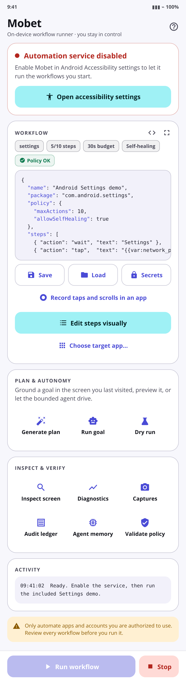
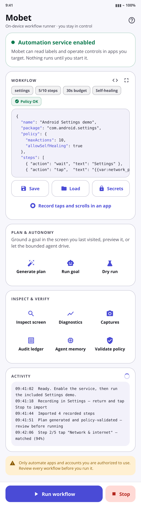
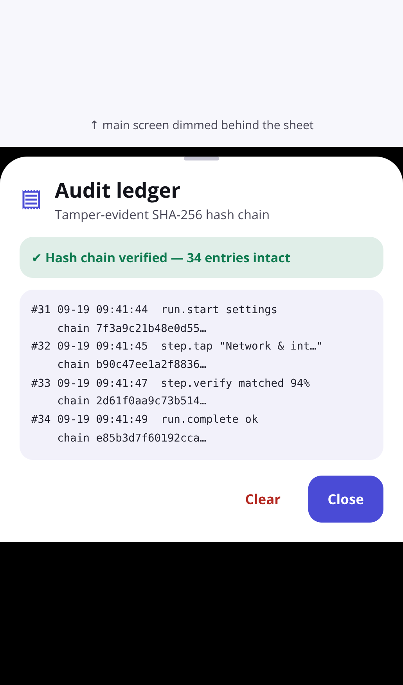
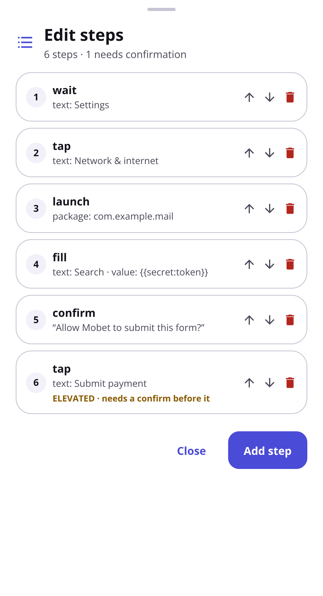

# Testing walkthrough — Mobet v0.7.0

Hands-on verification for the v0.7.0 build (Material 3 redesign, Tier 1–3 features,
eleven security fixes). Install `mobet.apk` from the
[v0.7.0 release](https://github.com/o48902808-creator/mobet/releases/tag/v0.7.0) or
the stable URL:

```
https://github.com/o48902808-creator/mobet/releases/latest/download/mobet.apk
```

> [!IMPORTANT]
> **Coming from v0.8.0 or earlier? Uninstall it first.** Those builds were
> debug-signed; v1.0.0 onward is production-signed, so an in-place update fails with
> a signature-mismatch error. Uninstalling clears Mobet's saved workflows, secrets,
> captures, and audit ledger — export anything you want to keep first. From v1.0.0
> onward updates install in place. The release APK is an `assembleRelease` build
> signed in CI with a keystore held in repository secrets
> ([RELEASE_SIGNING.md](RELEASE_SIGNING.md)); verify it before installing with
> `bash scripts/verify-release-apk.sh --tag v1.0.0`.

You know you have the right build when the home screen is a Material 3 layout with a
**Service card** on top, two labelled tile grids (**Plan & autonomy** and
**Inspect & verify**), a scrollable **Activity** log, and a bottom run bar with
**Run workflow** and **Stop**. In **Settings › Apps › Mobet › App info** the version
reads **0.7.0 (8)**.


---

## 0. Unlock Android 13+ restricted settings — do this first

This is where sideloaded installs get stuck, and it must happen **before** you can
enable the accessibility service.

On Android 13 and newer, Accessibility access is a *restricted setting* for apps
installed outside an app-store session (applies to every `mobet.apk` download). The
service toggle in Accessibility settings appears greyed out; tapping it shows a
"Restricted setting" dialog. Mobet is not broken — the system is gating the
permission.

1. Open **Settings › Apps › See all apps › Mobet**.
2. On the **App info** page, tap the **⋮ menu in the top-right** — the one on the
   App info page itself, not the Accessibility settings menu and not the
   three-dot menu anywhere else.
3. Tap **Allow restricted settings**, then confirm with your PIN, pattern, or
   biometric.
4. Return to the app.

If you can't find it, Mobet helps: with the service still disabled the home screen
shows the link **“Toggle greyed out or ‘Restricted setting’?”**, which deep-links
straight to Mobet's App info page. Some OEM skins (Xiaomi/HyperOS, Samsung One UI,
Realme) relocate or additionally gate the option; installs via `adb install -r -g`
are exempt from the restriction entirely.



## 1. Enable the accessibility service

5. Back in Mobet, tap **Open accessibility settings** on the Service card.
6. Select **Mobet automation** and switch it **On**; accept Android's warning dialog
   (it is the standard platform prompt describing what accessibility services can do).
7. Return to Mobet. Verify:
   - The Service card turns green and reads **“Automation service enabled”**.
   - The **Run workflow** button in the bottom bar is now enabled (it stays disabled
     while the service is off, so a run can never silently fail).



## 2. Dry run — rehearse without touching the device

The editor ships preloaded with the included **Android Settings demo** workflow
(target `com.android.settings`, steps: wait for *Settings* → tap *Network &
internet* → wait → `confirm` → back).

8. Open the Android **Settings** app, then go back home (this gives Mobet a recent
   screen snapshot to grade against).
9. In Mobet, tap **Dry run** (tile grid **Plan & autonomy**).
10. A report sheet opens, subtitled *“Simulated against the last snapshot — the
    device is not touched”*. Verify:
    - Per-step grounding grades **✔ / ≈ / ✖** for each step in the plan.
    - The per-step risk tier and the `confirm` gate are listed.
    - Nothing happens on the device — no taps, no app switches. That is the point of
      a counterfactual dry run. (Any literal or secret fill values are masked in the
      report.)



## 3. Validate policy — static rule check

11. Tap **Validate policy** (tile grid **Inspect & verify**).
12. For the unmodified demo expect the green banner **“✔ Approved by policy”** with a
    summary (target package, `Actions 5 / 10`, runtime budget `30000 ms`,
    `Visual blocked`, `Self-heal allowed`).
13. Optional negative test: edit the JSON so `maxActions` is exceeded or a
    `package` outside `allowedPackages` is added, and validate again. Expect
    **“✖ Rejected — N violations”** with each rule violation listed per step. Revert
    with **Format**'s sibling — or just paste the demo JSON back from
    `app/src/main/assets/sample_workflow.json`.

## 4. Run — and deliberately DENY the gate, then allow it

The `confirm` step in the demo exists solely for this test: the confirmation gate is
Mobet's core safety property. A run must stop dead when you refuse it.

14. Put the **Settings** app on your home screen or leave it closed; then tap
    **Run workflow**. Watch the Activity log as it finds Settings, taps *Network &
    internet*, and waits on the page.
15. When the **confirm** step arrives, a dialog titled **Workflow confirmation**
    pops up: *“Allow Mobet to return to the previous screen?”* with **Approve** and
    **Deny**.
16. **First refusal — tap Deny.** Verify:
    - The run finishes immediately with the status **“Confirmation denied”**.
    - Settings does **not** navigate back; the phone stays exactly where denial left
      it. Denial is a real stop, not a pause.
    - The Activity log and the **Audit ledger** (Inspect & verify) each record the
      denial.
    - The gate also fails closed on its own: leave a prompt unanswered for two
      minutes (or rotate the phone while it is open, which destroys the dialog) and
      the run finishes with **“Confirmation timed out — action denied”** — it can
      never hang in “Waiting for confirmation”.
17. Run the same workflow again, and this time tap **Approve** at the same prompt.
    Verify the runner presses Back, the workflow completes, and the log reports
    success.
18. Stop mechanism: start the demo once more and tap **Stop** mid-run (bottom bar).
    The run halts immediately; the ongoing notification's emergency Stop does the
    same from outside the app.

### Hardened critical gate (optional)

`CRITICAL`-scored steps (financial/destructive wording, e.g. “Confirm transfer of
$500”) never show a one-tap dialog. They raise **“⚠ Critical action confirmation”**:
the **Confirm** button stays disabled until you type the exact word `APPROVE` into
the field — a stray tap can never authorize it — and **Deny** is always available
and aborts instantly. A mistyped word leaves the button inert; it cannot be
accidentally tapped through. Type anything else and press Confirm after typing the
wrong word: the log reports *“Typed confirmation did not match APPROVE — action
denied”*.

## 5. Explore the rest of the new UI (no device risk)

These don't need the service, and none of them touch other apps:

- **Visual step builder** — tap **Edit steps visually** above the JSON field. Reorder
  steps with the move handles, edit fields, delete a step, and close: the JSON in the
  editor is rewritten to match. The builder and the text editor are two views of the
  same document.

  

- **App picker** — tap **Choose target app…**, type a few letters in the **Search**
  field, and pick an installed app: its package name is inserted as the workflow
  target. An empty query result shows **No matches**.
- **Summary chips** — edit the JSON and watch the chips under the field re-parse on
  every keystroke, reporting target package, step/runtime budgets, visual-fallback
  and self-healing posture, and the policy verdict while you type.
- **Save / Load / library** — **Save** stores the buffer by name, **Load** restores
  it. Deleting a library entry asks for a second confirmation and can be reversed
  with **Undo** from the snackbar.
- **Export / import** — **Export workflows…** writes a JSON bundle of the library and
  opens the system share sheet via FileProvider. **Import workflows…** adds a bundle:
  entries are merged, and overwrites of existing names ask first. Secret *values* are
  never exported — a `{{secret:name}}` reference travels without its value, so
  re-enter secrets after importing on a new device.
- **Secrets** — save a value under a name, reference it as `{{secret:name}}` in a
  `fill` step, and confirm the run log shows the masked value, never the plaintext.
- **Record** — **Record** captures your taps and scrolls in the target app and turns
  them into a starter workflow. Stopping a recording imports the captured steps.
- **Inspect screen** — dumps the current accessibility snapshot (labels, bounds,
  clickables) so you can see exactly what a selector will match.
- **Diagnostics / Captures / Audit ledger / Agent memory** — log detail, consented
  screenshots (private app storage only), the hash-chained runner history
  (**✔ Hash chain verified** banner on open), and the encrypted on-device memory
  browser. Clearing memory or deleting a secret asks twice and says so.

## Troubleshooting

| Symptom | Cause and fix |
| --- | --- |
| Accessibility toggle greyed out / “Restricted setting” dialog | Android 13+ has not unlocked sideloaded apps — do step 0 (App info → ⋮ → *Allow restricted settings*). |
| **Run workflow** is disabled | The service is off. The Service card should be red with **Open accessibility settings** — enable it in Accessibility settings. |
| Installer refuses the APK over the old build | Signature mismatch between debug builds. Uninstall the old Mobet, then install (step 0 note applies). |
| Run can't find a control | Run **Inspect screen** to see what Mobet actually sees, then fix the step text — or enable `allowSelfHealing` (LOW-risk steps only, one-shot, confidence-floored). |
| Every step grades **✖** in Dry run | The simulation grades against the *last* snapshot. Open the target app and navigate near the first step, then dry-run again. |

## What this walkthrough deliberately covers

v0.7.0's 180 automated tests are pure JVM unit tests, so anything involving a real
`Context`, the Android Keystore, or the accessibility service is only ever verified
on a physical device — which is exactly what steps 0–4 exercise. The two behaviors
worth checking on every install: **the confirmation gate (Deny path) and Stop must
work every time**, and the Service card must accurately reflect service state with
no stale green.

Screenshots in `docs/screenshots/` are rendered from the app's own resource files
(`colors.xml`, `strings.xml`, vector drawables) so they match the v0.7.0 build; they
approximate, not capture, Android's layout engine.
